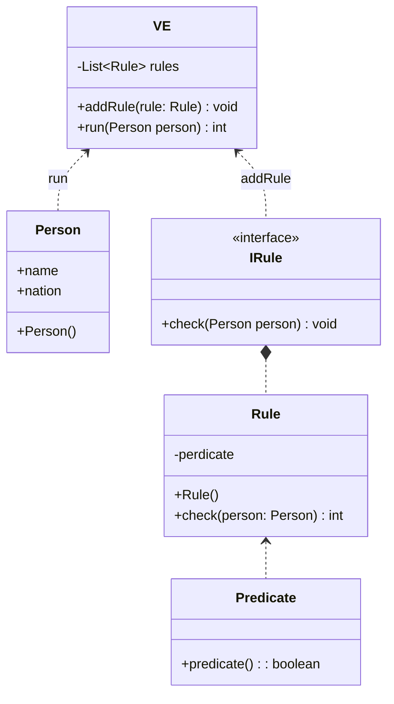
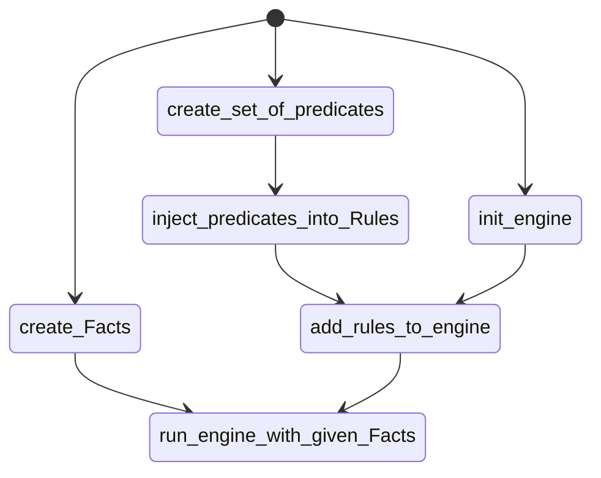
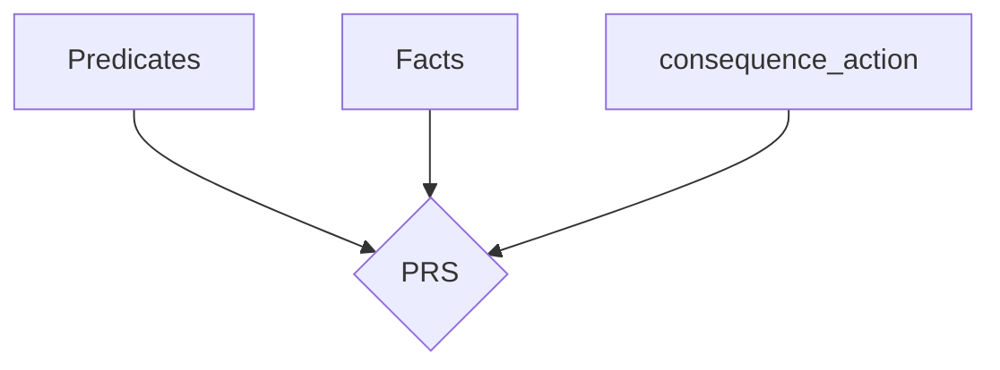
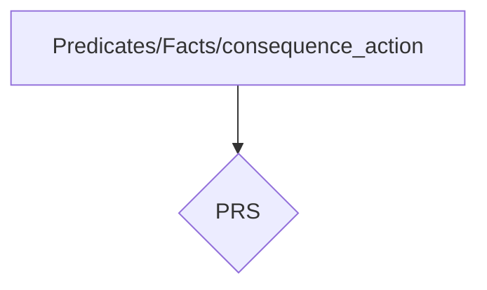

# ProductionRuleSystem
A simple demo of production rule system from Domain Specific Languages by Martin Fowler

```mermaid
classDiagram
    class Person {
        +name
        +nation
        +Person()
    }
    class VE {
        -List~Rule~ rules
        +addRule(rule: Rule) void
        +run(Person person) int
    }
    class IRule {
        <<interface>>
        +check(Person person) void
    }
    class Rule {
        -perdicate
        +Rule()
        +check(person: Person) int
    }
    class Predicate {
        +predicate(): boolean
    }
    IRule *.. Rule
    VE <.. Person : run
    VE <.. IRule : addRule
    Rule <.. Predicate
``` 

```mermaid
stateDiagram-v2
    [*] --> init_engine
    [*] --> create_set_of_predicates
    create_set_of_predicates --> inject_predicates_into_Rules
    inject_predicates_into_Rules --> add_rules_to_engine
    init_engine --> add_rules_to_engine
    [*] --> create_Facts
    create_Facts --> run_engine_with_given_Facts
    add_rules_to_engine --> run_engine_with_given_Facts
    
``` 

```mermaid
flowchart TD
    Predicates --> C{PRS}
    Facts --> C
    consequence_action--> C
```

```mermaid
flowchart TD
    Predicates/Facts/consequence_action --> C{PRS}
```
    

5-4-25 TN
- init PRS in Rust
